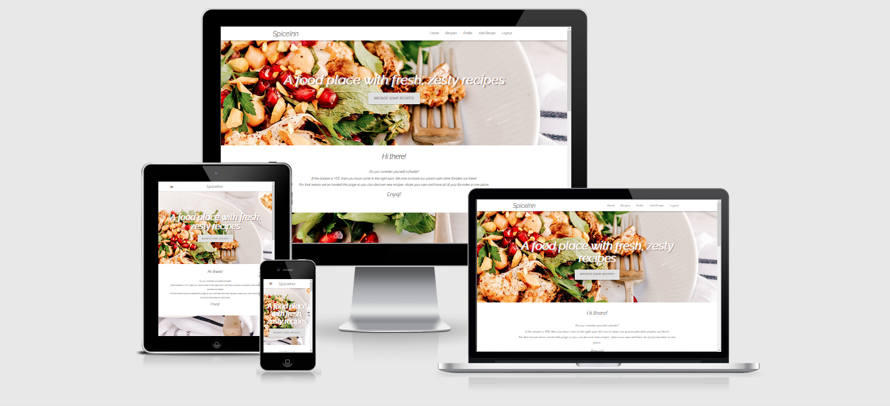
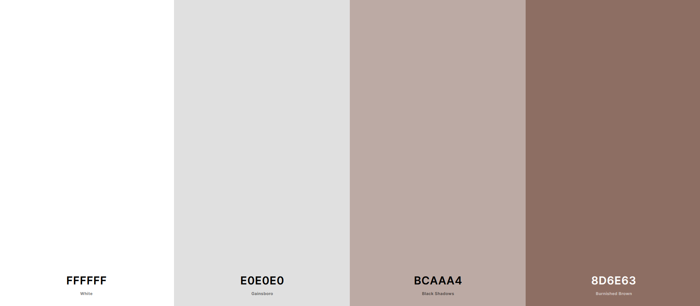
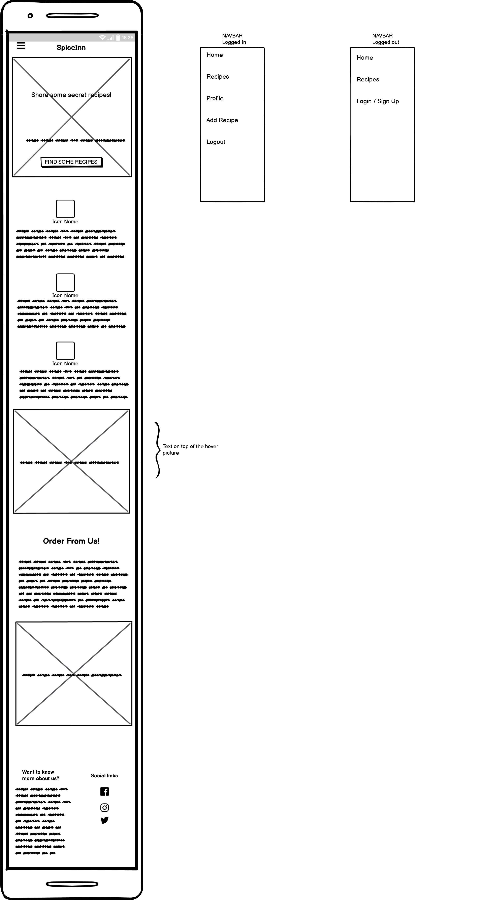
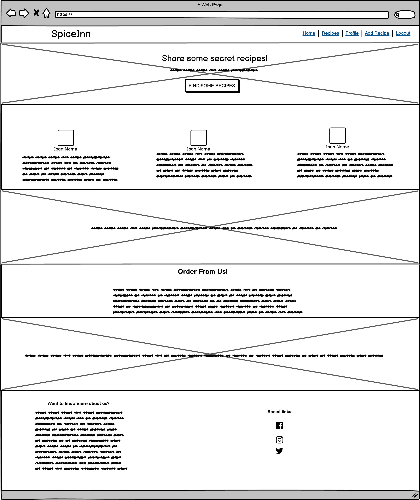
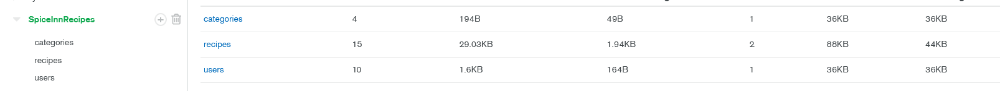

# Milestone 3 Project - SpiceInn

  SpiceInn is a company restorount owned by family friend. The target audience of the website are home cooks, amateur cooks and not necessarily professional cooks, although anyone is welcome.
  
  Recipes will be visible to non-registered users, but users must register to be able to post and edit their own recipes.

  Deployed website can be viewed [here](https://milestone-project-3-sami.herokuapp.com/)

   

## Contents

- [**User Experience (UX)**](<#user-experience-(ux)>)

  - [Project Goals](#project-goals)
  - [User Goals](#user-goals)
  - [Design](#design)
  - [Wireframes](#wireframes)

- [**Features**](#features)

  - [Existing Features](#features)
  - [Features Left to Implement](#features)

- [**Technologies**](#technologies-used)

  - [Languages Used](#technologies-used)
  - [Frameworks, Libraries and Programs Used](#technologies-used)

- [**Testing**](#testing)

- [**Deployment**](#deployment)

- [**Credits**](#credits)

---


## User Experience (UX)

### Project Goals

- Create a website where users can get inspired and where they can share their favorite recipes
- Create a navigation throughout the site and place where users can register and login in order to manage their posts.
- Implement a use of CRUD (create, read, update and delete) functionalities for users recipes.
- Implemet following technologies : HTML, CSS, JavaScript, Plython, Flask and MongoDB

## User Stories

### New User Goals:
* As a user, I want to be able to view recipes to cook
* As a user, I want to be able to register for the website and post my own recipes
* As a user, I want to be able to share my own recipes with the community in an easy way.
* As a user, I want to be able to find new recipes.
* As a user, I want to be able to edit/update my posted recipes
* As a user, I want to be able to delete my posted recipes

### Returning User Goals:
* As a returning user, I want to be able to edit/update my posted recipes
* As a returning user, I want to be able to delete my posted recipes

### Site Owner User Goals:
* As the site owner, I want to share the recipes added on this website
* As the site owner, I want to attract the audience with tempting nice design of the website.


### Design
- The design of this project is based on simplicity. Mostly Materialize was used as their templates bring attractive and nicely-set look. Scroll-over background image has been used which gives a meaning to the page on first glance.

#### Colors

- I've used four colors throughout the site.



#### Typography

- I used only one font for this website. The name of the font is : **Raleway**, and it was taken from Google Fonts. I decided to use Raleway as it presents more modern look. It is clear to read and looks simple.


### Wireframes

- Please find all of my wireframes [here](https://github.com/sami-sinnari/MilestoneProject3/blob/master/static/wireframes/spice-inn-wireframes.pdf)

- The wireframes for landing page on desktop, mobile and tablet are below : 




#### [Back to Contents](#contents)

---

## Features

### Existing Features : 

- **Navigation**: 

  Standard Materialize based navigation bar was added with clear name of the company on the left in desktop view and centered in mobile view

- **Footer**: 

  Template footer has been used to include "What We Are" info and Social links of the restoraunt.

- **Home Page**: 

  Template landing page has been used and modified to fit developers design. The banner will welcome user with button that will leade to the recipes section. Included are information relevant to the website and quotes to spread positivity about recipes.

- **Profile**:

  Once logged in, user will be transferred onto the profile page. Here is where they will be able to modifiy their posts. The options given to them are : Edit and Delete

- **Flash messages**

  Customized flash messages will appear for successful and non-successful registration, successful sign in and out, successfully updated and added recipes.

- **Add / Edit recipe** :

  Once logged in, users have the option to Add or Edit the recipe. If the navbar, they will see the option "Add Recipe". Once clicked, they will fill the relevant information in the form, and by clicking " Add Recipe", the recipe will be posted to all of the community.

- **Delete**:

  If user's wants to delete a recipe, they will have to login first. I have added *defensive programming* by using a pop-up modal, which will ask them if they want to proceed with removal of the recipe.

- **Sign In / Sign Up**:

  The benefit of Signing Up, is the availablity of adding and customizing recipes. If a person is not registered, they have the option to Sign Up. Once they Sign Up, they wil be redirected to their own profile where they will be greeted with message in border : "Welcome, User "

- **Logout**:

  If user clicks "Logout", they will be redirected to the page of "Sign In", as they might needs to Sign In again.

- **Search**:

  As the site will grow there will be more recipes, therefore I have added a search functionality where users will be able to search by entering a name of the recipe.

**Database skeleton**

- The skeleton of my database is as follows : 




- **categories** : 

    category_name

- **recipes** : 

    recipe_name

    category_name

    img_url

    cooks_ini

    recipe_ingredients

    recipe_method

    is_vegetarian

    added_by

    views ( views has been added in code for future plan, which will be mentioned in the *features left to be implemented*)

- **users** :

    username

    password
    
**Security**

- The website uses [Werkzeug's](https://werkzeug.palletsprojects.com/en/1.0.x/) password protection system. Werkzeug hashes the password entered by the user, converts the password into another string and then it is salted (additional data added). This makes the password very tough to crack. 


### Features Left to Implement :


#### [Back to Contents](#contents)

---

## Technologies Used

### Languages

 [HTML5](https://en.wikipedia.org/wiki/HTML5)
>
 [CSS3](https://en.wikipedia.org/wiki/Cascading_Style_Sheets)
>
 [JavaScript](https://en.wikipedia.org/wiki/JavaScript)

 [Python](https://en.wikipedia.org/wiki/Python_(programming_language))

### Frameworks, Libraries and Programs:

 [Flask](https://fontawesome.com/)

 [MongoDB](https://www.mongodb.com/) 

 [Gitpod](https://www.gitpod.io/) 

 [Materialize](https://materializecss.com/about.html) 

 [Font Awesome](https://fontawesome.com/) 

[Google Fonts](https://fonts.google.com/) 

 [Balsamiq](https://balsamiq.com/) 

#### [Back to Contents](#contents)

---

## Testing

### Code validity

**PEP8 Compliant:**

   I have used [PEP8](http://pep8online.com/) to check my app.py files complied with the PEP8 requirements. The results were 6 errors, all of them in regards to indentation and whitelines.

  Second test has passed with no errors

**W3C CSS Validator**
I have used the [W3C CSS Validator](https://jigsaw.w3.org/css-validator/) to check the validity of my CSS code.
 Test was passed with **no** errors

**W3C HTML Validator**
I have used the [W3C HTML Validator](https://validator.w3.org) to check the validity of my HTML code on all pages.
  Test was passed with **no** errors

**JSHINT**
I have used  [JSHINT](https://jshint.com/) to check validity of my JS code - No big/concerning errors.

### Testing User Stories 

* As a user, I want to be able to view recipes to cook

  **Created a special website link "Recipes" dedicated to all different recipes upload by other user's and site owner**

* As a user, I want to be able to register for the website and post my own recipes

  **Created a link which will leade to "Sign Up" page where new users can register. Once registered, they will be able to post their own recipes**

* As a user, I want to be able to share my own recipes with the community in an easy way.

  **Created a share buttons under each recipe added on the website. User's are able to noticve them easily**

* As a user, I want to be able to find new recipes.

  **Created a page where all of the recipes are added once posted. User's are able to browse them wheter registered or not**

* As a user, I want to be able to edit/update my posted recipes

  **Added customization options on each recipe profile of each registered user, where they can either edit/update their recipes**

* As a user, I want to be able to delete my posted recipes

  **Added removal options on each recipe profile of registered user, where they can delete their recipes**

### Further Testing

**Manual testing**
- The website (code) has been tested in browsers and few different mobile devices. Site appeared to be fully functional on each.

### Bugs and defense
- Authorisation issue - *defense design* 

   User was able to edit other users recipes when not logged in via https, just by adding edit_recipe in the link. Implemented code to fix the problem.

- Removing issue - *ID error*

    Whenever a user would decide to delete a recipe, it would delete first recipe always. Noticed the issue is within the _id's, as always first _id was targeted. Added index.loop to asssing different _id to modals and now the user will delete recipe it want's to delete.

#### [Back to Contents](#contents)

 ---

## Deployment

### Deploying Website To Heroku
1. In the terminal, create a requirements.txt and Procfile using the following commands:

    - 1. pip3 freeze –local > requirements.txt
    - 2. echo web: python app.py > Procfile

2. Commit the new files to GitHub
3. Within my Heroku.com account I created a new App called milestone-project-3-sami and chose the region Europe.
4. Within the deploy sections which opened automatically after creating the app, I selected the Deployment Method of Connecting to GitHub via the logo. 
5. Beneath this I typed the GitHub repository name MilestoneProject3 and hit search. When the correct repository was found I clicked the ‘connect’ button.
6. Next, I clicked on ‘Settings’, then in Config Vars, I clicked ‘Reveal config Vars’. I filled out the Config Vars with relevant information. That info is stored in env.py file.
7. In Deploy, I clicked ‘Enable Automatic Deploys’ and deployed from the Master branch.
8. Then clicked ‘Deploy Branch’ and the app was deployed successfully at the URL https://milestone-project-3-sami.herokuapp.com/

### To Create a Clone of the SpiceInn Repository
Cloning the repository makes a copy of the of the repository which you download and store on your machine locally.

To make a clone of SpiceInn, follow the following steps:
1. Visit the main repository of SpiceInn [here](https://github.com/sami-sinnari/MilestoneProject3)
2. Click on the button with the text **"Code"**.
3. Click on **“Open with GitHub Desktop”** and follow the prompts in the GitHub Desktop Application or follow the instructions from [this](https://docs.github.com/en/github/creating-cloning-and-archiving-repositories/cloning-a-repository-from-github/cloning-a-repository#cloning-a-repository-to-github-desktop) link to see how to clone the repository in other ways.

- **Working with local copy**

1. Install all the requirements: Go to the workspace of your local copy. In the terminal window of your IDE type: pip3 install -r requirements.txt.

2. Create a database in MongoDB
    
    - Login to your MongoDB account
    - Create a cluster and a databse
    - Create three collections in the database: categories | recipes | users
    - Add values for those collections

3. Create enviroment variables

    - Create .gitignore file in the directory and add env.py file in .gitignore
    - env.py file will contain following information : 

    ````
	    Import os
	    os.environ.setdefault("IP", "To be added by user")
        os.environ.setdefault("PORT", "To be added by user")
        os.environ.setdefault("SECRET_KEY", "To be added by user")
        os.environ.setdefault("MONGO_URI", "To be added by user")
        os.environ.setdefault("MONGO_DBNAME", "To be added by user")
    
Run the app: Open your terminal window in your IDE. Type python3 app.py and run the app.

#### [Back to Contents](#contents)

---

## Credits
### Pictures

- Pictures used in this project were download from [Jamie Oliver's](https://www.jamieoliver.com/) website.

- Favicon used in this project has been downloaded from free favicon website [**Favicon**](https://favicon.io/)

### Code

- Code written in HTML files has been used with [Materialize](https://materializecss.com/) templates.

     Home page view can be found here :  https://materializecss.com/templates/parallax-template/preview.html

- Share buttons on recipes were added as a plugin by [Sharethis](https://sharethis.com/)

  **app.py** : 

  - Python code has been taught by Code Institute.

  - The view count has been taught here  :https://python-forum.io/thread-15027.html - the code has been added as a future plan.

  - Error handlers were taught by Flask docs : https://flask.palletsprojects.com/en/1.1.x/errorhandling/

### Content

- Content of Home page has been written by the developer. Developers recipes content has been added from [Jamie Oliver's](https://www.jamieoliver.com/) recipes. Other recipes have been added by users/testers of this website.

### Acknowledgements

- I would like to thank my knowledgeable mentor Can Sucullu for helping me with my project Ideas and guiding me properly on how to fix occured errors and bugs. Moreover, I would like to thank him again for giving me the knowledge of defense in web-development. 

- I would like to thank my fellow students at Code Institue and my Slack group, Jun-2020 for all the help and assistance.

- I would also like to thank the Tutors who helped me solve the bugs I faced. Special thanks to Sean from Tutor support.

#### [Back to Contents](#contents)

---

This site was built for educational purposes only. If you find any content not mentioned in **Credits** that violates the copyrights, please contact me on samisinnari@gmail.com

---
